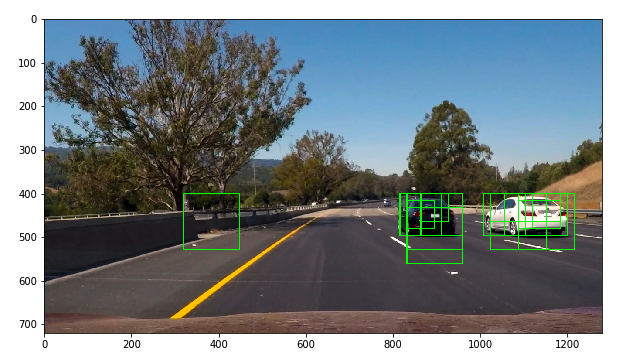
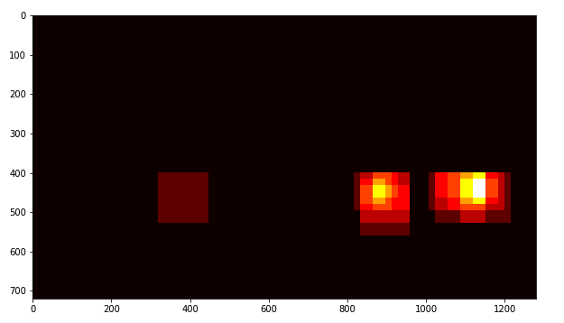
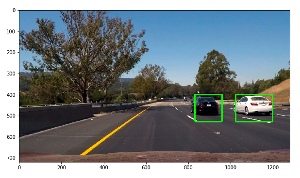

# Vehicle Detection and Tracking
> Leveraging OpenCV, HOG, and SVM for accurate vehicle detection and tracking in video streams.

This project develops a robust pipeline for vehicle detection and tracking, utilizing a combination of computer vision techniques and machine learning. By applying Histogram of Oriented Gradients (HOG) feature extraction and training a Linear Support Vector Machine (SVM) classifier, the system efficiently identifies and tracks vehicles in highway driving videos.

## Project Goals
- **HOG Feature Extraction**: Extract HOG features from a labeled dataset of images to train a vehicle detection classifier.
- **Color Space Exploration**: Investigate the impact of different color spaces on feature extraction and classifier performance.
- **Sliding Window Search**: Implement a sliding-window technique to locate vehicles within images.
- **Video Processing**: Apply the detection pipeline to video streams, enhancing detection stability and reducing false positives through heatmap analysis.

## Technical Approach

### Histogram of Oriented Gradients (HOG)
- **Feature Extraction and Training**: Utilized HOG for feature extraction from vehicle and non-vehicle images, training a Linear SVM classifier for reliable vehicle detection.
- **Optimization of Parameters**: Achieved optimal performance and processing speed by experimenting with various HOG parameters and color spaces, settling on the YUV color space for its effectiveness in distinguishing vehicle features.

### Sliding Window Search
- **Adaptive Scales and Overlap**: Implemented variable window sizes and overlaps to accommodate vehicles at different distances from the camera, enhancing detection accuracy across the image.

### Video Implementation
- **Heatmap Integration**: Reduced false positives and accurately tracked vehicles by creating heatmaps from positive detections and applying thresholding to isolate reliable detections.

### Results and Examples
- Demonstrated successful vehicle detection and tracking across different frames of video, effectively handling varying vehicle sizes and positions with minimal false positives.

#### Example Frames and Heatmaps

## Discussion

### Challenges
- **Dynamic Environments**: Adjusting detection algorithms to account for varying lighting conditions, vehicle colors, and sizes presents ongoing challenges.
- **False Positives**: Despite improvements, occasional false positives highlight the need for further model refinement.

### Future Enhancements
- **Deep Learning**: Explore the integration of convolutional neural networks (CNNs) for more robust feature extraction and classification.
- **Real-Time Processing**: Optimize the pipeline for real-time vehicle detection and tracking in live video feeds.
- **Dataset Expansion**: Enhance the training dataset with more varied images to improve classifier robustness against diverse real-world driving conditions.
